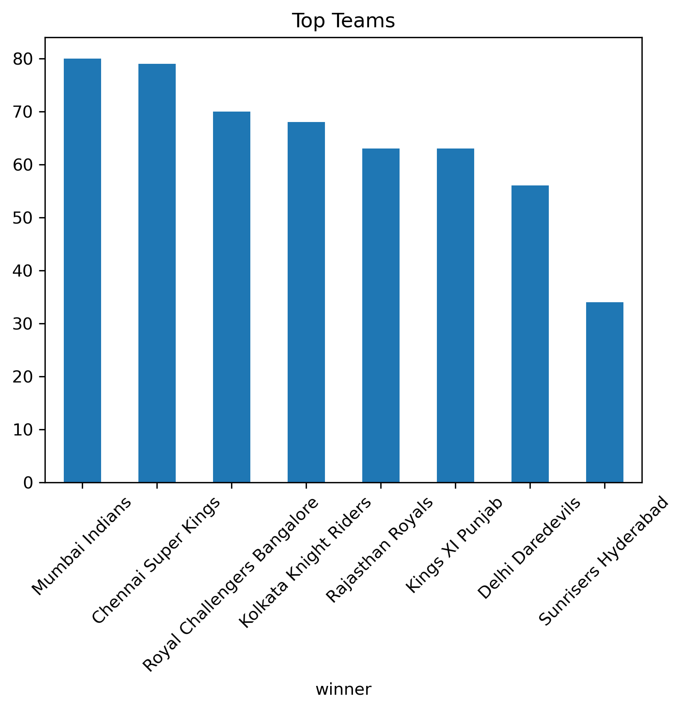

# IPL Data Analysis Using Python

## Objective
Analyze IPL match data to understand team performance and identify key factors affecting match outcomes.

## Tools Used
- Python
- Pandas
- Matplotlib

## Dataset
The dataset contains IPL match data including teams, winners, toss results, and match statistics.

## Analysis Performed
- Data cleaning and preprocessing
- Team performance analysis
- Toss impact analysis
- Win type analysis (runs vs wickets)
- Player performance analysis

## Team Performance

This chart shows the most successful teams based on total match wins.

## Key Insights
- Mumbai Indians has the highest number of wins  
- Toss-winning teams win approximately XX% of matches  
- Most matches are won by wickets (chasing advantage)  
- Certain players consistently win Player of the Match  

## Conclusion
This project highlights important patterns in IPL matches and demonstrates how data analysis can be used to understand sports performance.
